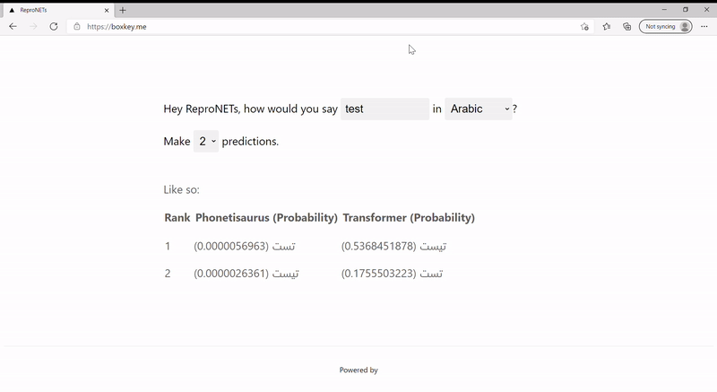

# Reproducible Named Entity Transliteration (ReproNETs)

ReproNETs is a hub for named entity transliteration models. 
It hosts trained models and provides simple interfaces to make them accesssible. 

The models avaiable:
* [Phonetisaurus](https://github.com/AdolfVonKleist/Phonetisaurus) 
* [Transformer](https://arxiv.org/abs/1706.03762)

The languages we currently support:
* English to Arabic
* English to Chinese
* English to Hebrew
* English to Japanese
* English to Korean
* English to Russian

## GUI

<p align="center">
 <a href='https://boxkey.me/'>
   
 </a>
</p>

GUI provides a tool to easily and visually compare outputs across the `Transformer` and the `Phonetisaurus` with different beam sizes. It shows predicted sequence(s) along with the probability of each sequence. 

Link: https://boxkey.me

## API

ReproNETs provide a public API that provides transliteration as a service via simple HTTP request. 

The query parameters are:
* input: Any English word to transliterate. It must be less than or 37 characters.
* language: The target language. It must be either `ara`, `chi`, `heb`, `jpn`, `kor`, or `rus`. 
* beam: The size of beam search. It must be an integer from 1 to 5.
* model: The name of a transliteration model. It must be either `phonetisaurus`, `transformer` or `all`.

## GET
This is mainly used for a real-time prediction.

### Request

``` bash
curl --request GET   \
  --url 'https://boxkey.me/repronets/api/predict?input=rocky&language=jpn&beam=3&model=all' \
  --insecure
```

### Response

```javascript
{
  "data": {
    "phonetisaurus": {
      "data": {
        "No.1": {
          "prob": 0.0000018659,
          "tokens": "ロッキー"
        }
      },
      "status": 200,
      "message": "Successfully made predictions"
    },
    "transformer": {
      "data": {
        "No.1": {
          "prob": 0.8028546389,
          "tokens": "ロッキー"
        }
      },
      "status": 200,
      "message": "Successfully made predictions"
    }
  },
  "status": 200
}
```

## POST
This is mainly used for a batch prediction.

### Request

```bash
curl --request POST \
  --url https://boxkey.me/repronets/api/predict \
  --header 'Content-Type: application/json' \
  --data '{
	"language": "jpn",
	"model": "all",
	"beam": 2, 
	"batch": [
		{"idx": 0, "src": "Rocky"},
		{"idx": 1, "src": "Thomas"},
		{"idx": 2, "src": "James"}
	]
}'
```

### Response

```javascript
{
  "data": {
    "phonetisaurus": {
      "data": [
        {
          "output": {
            "No.1": {
              "prob": 0.0000018659,
              "tokens": "ロッキー"
            },
            "No.2": {
              "prob": 1.32e-8,
              "tokens": "ロッキ"
            }
          },
          "idx": 0
        },
        {
          "output": {
            "No.1": {
              "prob": 0.0000017158,
              "tokens": "トマス"
            },
            "No.2": {
              "prob": 7.749e-7,
              "tokens": "トーマス"
            }
          },
          "idx": 1
        },
        {
          "output": {
            "No.1": {
              "prob": 4.814e-7,
              "tokens": "ジェームズ"
            },
            "No.2": {
              "prob": 4.094e-7,
              "tokens": "ジャムズ"
            }
          },
          "idx": 2
        }
      ],
      "status": 200,
      "message": "Successfully made predictions for all samples."
    },
    "transformer": {
      "data": [
        {
          "output": {
            "No.1": {
              "prob": 0.7512613521,
              "tokens": "ロッキー"
            },
            "No.2": {
              "prob": 0.0077491008,
              "tokens": "ロキー"
            }
          },
          "idx": 0
        },
        {
          "output": {
            "No.1": {
              "prob": 0.4929688724,
              "tokens": "トマス"
            },
            "No.2": {
              "prob": 0.1147175511,
              "tokens": "トーマス"
            }
          },
          "idx": 1
        },
        {
          "output": {
            "No.1": {
              "prob": 0.302035911,
              "tokens": "ジェイムズ"
            },
            "No.2": {
              "prob": 0.1576093547,
              "tokens": "ジャメス"
            }
          },
          "idx": 2
        }
      ],
      "status": 200,
      "message": "Successfully made predictions for all samples."
    }
  },
  "status": 200
}
```

## Contribution

Thank you for your interest in contributing to the `ReproNETs` codebase.
Models can be uploaded under the `./moedls` directory ideally as a docker container.
If you need help with containerizing your model, let us know at [`Issues`](https://github.com/box-key/ReproNETs/issues).

## License

Copyright 2020- Kei Nemoto, All Rights Reserved

Licensed under the Apache License 2.0: http://www.apache.org/licenses/
